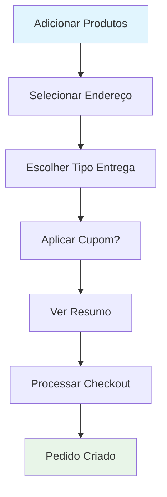

# 🎯 POC SOLID - Sistema de Checkout

## 📚 Sobre o Projeto

Este projeto é uma **Prova de Conceito (POC)** desenvolvida para **fins educacionais**, demonstrando a aplicação prática dos **5 Princípios SOLID** em um sistema real de checkout/e-commerce usando **Flutter** e **Clean Architecture**.

### 🎓 **Para Estudantes e Desenvolvedores**

O projeto foi criado como **material de estudo** para:
- **Desenvolvedores Flutter** que querem aprender SOLID
- **Estudantes de Engenharia de Software**
- **Arquitetos de Software** buscando referências práticas
- **Times de desenvolvimento** que querem implementar Clean Architecture

---

## 🏗️ **Arquitetura Implementada**

### **Clean Architecture (4 Camadas)**

```
📁 lib/
├── 🔵 domain/           # Regras de Negócio
│   ├── entities/        # Entidades de domínio
│   ├── repositories/    # Interfaces de repositórios
│   └── usecases/        # Casos de uso (11 implementados)
├── 🟢 data/             # Implementação dos Dados
│   └── repositories_impl/ # Implementações dos repositórios
├── 🟡 external/         # Serviços Externos
│   └── services/        # APIs e serviços externos
└── 🟠 presentation/     # Interface do Usuário
    ├── components/      # Componentes reutilizáveis (6)
    ├── viewmodels/      # Gerenciamento de estado
    └── views/           # Telas da aplicação
```

---

## ⚡ **Tecnologias e Conceitos**

### **Flutter & Dart**
- **Flutter 3.x** - Framework UI
- **Dart** - Linguagem de programação
- **Material Design 3** - Design system

### **Gerenciamento de Estado**
- **ChangeNotifier** - Estado global reativo
- **ValueNotifier** - Estado granular
- **ValueListenableBuilder** - Widgets reativos
- **AnimatedBuilder** - Animações de estado

### **Padrões Arquiteturais**
- **Clean Architecture** - Separação de responsabilidades
- **MVVM** - Model-View-ViewModel
- **Repository Pattern** - Abstração de dados
- **Dependency Injection** - Inversão de controle

---

## 🎯 **Princípios SOLID Demonstrados**

### **🔹 SRP - Single Responsibility Principle**
- **11 casos de uso** específicos (ValidarCarrinho, ProcessarPagamento, etc.)
- **6 componentes** com responsabilidade única
- **ViewModels focados** em domínios específicos

### **🔹 OCP - Open/Closed Principle**
- **Extensibilidade** sem modificar código existente
- **Novos casos de uso** podem ser adicionados facilmente
- **Componentes plugáveis**

### **🔹 LSP - Liskov Substitution Principle**
- **Implementações substituíveis** pelas interfaces
- **Polimorfismo correto** em repositórios
- **Contratos bem definidos**

### **🔹 ISP - Interface Segregation Principle**
- **Interfaces específicas** por domínio
- **Separação clara** de responsabilidades
- **Sem dependências desnecessárias**

### **🔹 DIP - Dependency Inversion Principle**
- **Injeção de dependência** em todas as camadas
- **Abstrações** em vez de implementações concretas
- **Inversão de controle** completa

---

## 🚀 **Funcionalidades Implementadas**

### **📱 Interface Completa e Reativa**
- ✅ **Carrinho de Compras** - Adicionar/remover produtos
- ✅ **Busca de Endereços** - Com estado de loading
- ✅ **Tipos de Entrega** - Delivery, Retirada, Local
- ✅ **Sistema de Cupons** - Aplicação de descontos
- ✅ **Cálculos em Tempo Real** - Subtotal, taxas, total
- ✅ **Checkout Completo** - Processamento do pedido

### **⚙️ Casos de Uso (Use Cases)**
1. **ValidarCarrinho** - Validações de negócio
2. **CalcularSubtotal** - Soma dos produtos
3. **CalcularTaxaEntrega** - Baseado na localização
4. **CalcularTaxaServico** - Percentual sobre subtotal
5. **BuscarEnderecos** - Busca endereços disponíveis
6. **DefinirTipoEntrega** - Configura tipo de entrega
7. **AplicarCupom** - Aplica descontos
8. **ProcessarPagamento** - Simula pagamento
9. **CriarPedido** - Cria entidade de pedido
10. **SalvarPedido** - Persiste pedido
11. **BuscarPedidos** - Lista pedidos salvos

---

## 🛠️ **Como Executar o Projeto**

### **Pré-requisitos**
- **Flutter SDK** 3.0+ instalado
- **Dart SDK** 3.0+
- **IDE** (VS Code, Android Studio, IntelliJ)
- **Emulador** ou dispositivo físico

### **Passos para Execução**

1. **Clone o repositório**
   ```bash
   git clone https://github.com/seu-usuario/chekout_solid_sr.git
   cd chekout_solid_sr
   ```

2. **Instale as dependências**
   ```bash
   flutter pub get
   ```

3. **Execute o projeto**
   ```bash
   flutter run
   ```

4. **Para análise de código**
   ```bash
   flutter analyze
   ```

---

## 📖 **Como Estudar Este Projeto**

### **1. 🎯 Comece pela Arquitetura**
- Estude a estrutura de pastas
- Entenda as 4 camadas da Clean Architecture
- Veja como as dependências fluem

### **2. 🔍 Analise os Princípios SOLID**
- Cada caso de uso demonstra **SRP**
- Interfaces mostram **LSP** e **ISP**
- Injeção de dependência exemplifica **DIP**
- Extensibilidade demonstra **OCP**

### **3. ⚡ Observe o Estado Reativo**
- **CheckoutCompletoViewModel** usa ChangeNotifier
- **ValueNotifier** para estado granular
- **ValueListenableBuilder** para reatividade
- **AnimatedBuilder** para cálculos dinâmicos

### **4. 🧩 Componentes Reutilizáveis**
- 6 componentes seguindo SRP
- Props bem definidas
- Callbacks para comunicação
- Design consistente

---

## 🎨 **Fluxo da Aplicação**



---

## 📚 **Conceitos de Estudo**

### **Clean Architecture**
- **Separação de responsabilidades**
- **Independência de frameworks**
- **Testabilidade máxima**
- **Flexibilidade de mudanças**

### **SOLID Principles**
- **Coesão e baixo acoplamento**
- **Extensibilidade sem modificação**
- **Substituição segura de implementações**
- **Interfaces focadas**
- **Inversão de dependências**

### **Flutter State Management**
- **ChangeNotifier pattern**
- **ValueNotifier granular**
- **Reactive UI updates**
- **Performance optimization**

---

## 🔬 **Para Desenvolvedores**

### **Estrutura de Testes (Preparada)**
```dart
// Exemplo de teste unitário
test('deve calcular subtotal corretamente', () {
  final useCase = CalcularSubtotal();
  final items = [Item('Produto', 10.0), Item('Produto2', 20.0)];
  expect(useCase.execute(items), equals(30.0));
});
```

### **Extensibilidade**
- Adicione novos casos de uso facilmente
- Crie novos componentes seguindo o padrão
- Implemente novos repositórios
- Estenda ViewModels existentes

---

## 🤝 **Contribuições**

Este projeto é **open source** para fins educacionais:

1. **Fork** o projeto
2. **Crie** uma branch para sua feature
3. **Commit** suas mudanças
4. **Push** para a branch
5. **Abra** um Pull Request

---

## 📞 **Suporte e Dúvidas**

Para dúvidas sobre implementação, arquitetura ou conceitos:

- **Issues** do GitHub para bugs
- **Discussions** para dúvidas conceituais
- **Wiki** para documentação adicional

---

## 📋 **Checklist de Aprendizado**

### **Iniciante**
- [ ] Entender estrutura de pastas
- [ ] Executar o projeto
- [ ] Navegar pela interface
- [ ] Identificar componentes

### **Intermediário**
- [ ] Analisar casos de uso
- [ ] Entender injeção de dependência
- [ ] Estudar ChangeNotifier/ValueNotifier
- [ ] Mapear fluxo de dados

### **Avançado**
- [ ] Implementar novos casos de uso
- [ ] Criar novos componentes
- [ ] Escrever testes unitários
- [ ] Propor melhorias arquiteturais

---

## 🎖️ **Créditos**

Projeto desenvolvido como material educacional demonstrando:
- **Princípios SOLID** na prática
- **Clean Architecture** com Flutter
- **Gerenciamento de Estado** reativo
- **Boas práticas** de desenvolvimento

---

**⭐ Se este projeto te ajudou nos estudos, considere dar uma estrela!**
